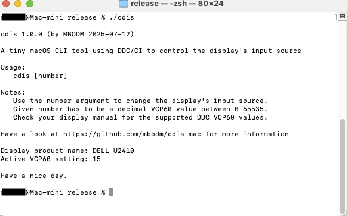

# cdis (macOS version)
A tiny macOS command line tool to change a display's input source by using DDC/CI

### What is it?

- It's a tiny command line tool for macOS (the `cdis` executable)
- Its name "cdis" stands for "**C**ontrol **D**isplay **I**nput **S**ource"
- It uses DDC/CI to control the input source of a DDC-capable external display/monitor
- It does this by using the native DDC capabilities of macOS (by using an open-source library)
- It's the macOS pendant of my Windows `cdis.exe` command line tool (see [here](https://github.com/mbodm/cdis))
- It's a macOS command line application and runs on any Apple Silicon Mac (M1/M2/M3/M4)
- Its release binary is of type `Mach-O 64-bit executable arm64` and has a size of ~300KB
- It's written in Rust and built by Rust's `cargo` tool (`aarch64-apple-darwin` target)
- It's built and developed with Rust 1.88.0 and VS Code 1.102.0
- It's built and developed on an Apple Silicon M4 mac mini (running macOS Sequoia 15.5)
- It uses the open-source `ddc-macos` [crate](https://crates.io/crates/ddc-macos) by Haim Gelfenbeyn as a dependency
- It's free-to-use and open-source (under MIT license)

### Why it exists?

It's possible to change the input source of a computer's display by software (in contrast to the hardware buttons of your display). Typically by using DDC/CI commands. The DDC VCP60 setting is the key component here.

I was just looking for some simple way to quickly switch my display's input source between 3 computers, with just one click. I found some tools out there (which all use DDC/CI too, of course). But i decided to build a simple and tiny tool by myself, which i can use in scripts or keyboard shortcuts.

As a result, this tool was born.

### How to use?

The tool itself should be rather self-explanatory.

- Just run the `cdis` executable to see which VCP60 value is currently active (and therefore the corresponding input source)
- By using the `[number]` argument you can set the VCP60 value (and therefore the corresponding input source)

"_DDC VCP60 value_", what?

Each VCP60 value represents one physical input source of your display. Either you just test each VCP60 value (by using the `[number]` argument), or you take a look into your display's user manual, to find out which VCP60 value corresponds to which physical input source.

### Support for earlier macOS/platform versions

Q: So, what about running `cdis` on some older macOS versions or "pre Apple Silicon" machines?

A: Sorry, if you still have an Intel Mac or even PowerPC Mac. Only Apple Silicon Macs are supported at the moment.

But i think it should be fairly easy, cause of Rust`s platform handling, to compile the source by your own (targeting those platforms).

### Support for multiple displays

Q: So, what about support for multiple displays?

A: Sorry, full multi-monitor support is somewhat "spicy" to do it the right way. Correctly determining all monitors, handling Desktop with "Extend" and "Duplicate" modes, and listing all devices correctly, ends up rather complex.

Therefore:
- `cdis` doesn't offer multi-monitor support
- `cdis` will always use the 1st/primary external monitor

I'm sorry `cdis` can't help you here. But feel free to fork it!

### Build from source

If you wanna build the executable on your own, just
- download the source
- download and install the latest Rust version
- execute the `cargo build --release` command

Feel free to enhance the source, fork it, adapt it into your own projects, or whatever. It's under MIT license. You can do with it whatever you want. 😜

### Videos

### Anything else?

A giant "Thanks!" to [Haim Gelfenbeyn](https://github.com/haimgel) for his work on `ddc-macos` (an open-source Rust crate, see https://crates.io/crates/ddc-macos). Without it, porting my Windows `cdis.exe` (see [here](https://github.com/mbodm/cdis)), in such a simple way, would not have been possible. DDC/Monitors on Apple Silicon is tricky. Haim did a great work!

**Have fun.**
